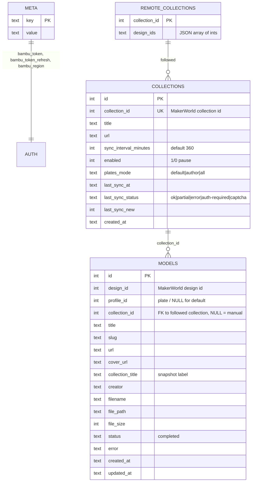

# Data Model & Storage

All persistent state lives in one SQLite file (`data/bambu_downloader.db`,
configurable via `BND_DB_PATH`), opened in **WAL** mode with
`synchronous=NORMAL` and a 30 s busy timeout so the API layer, the scheduler
and the boot-time metadata backfill can share it without "database is locked"
errors. Model files and covers live in the `downloads/` tree; the DB only
points at them.

---

## Entity-relationship overview



---

## Tables

### `meta` — key/value store

Auth and housekeeping state:

| key | contents |
| --- | --- |
| `bambu_token` | Bambu Cloud access token (**stored plaintext** — the DB directory is trusted; optional `BND_API_KEY` protects the API surface) |
| `bambu_token_refresh` | Refresh token; enables silent re-login (see architecture doc, token sequence) |
| `bambu_region` | `global` or `china` → picks `api.bambulab.com` vs `api.bambulab.cn` |
| `meta_scan_at`, `meta_scan_clean` | Metadata-backfill scan watermark (see below) |

### `models` — the library

One row per downloaded `(design_id, profile_id)` pair.

- `profile_id` is the **plate id** from the design's instance list (the
  `#profileId-N` URL fragment refers to this field), **NULL** when a design
  has no plates or was resolved to the default plate.
- `collection_id` links to the followed collection the download came through;
  NULL means a manual, single-URL download.
- `collection_title` is a **snapshot** taken at download time so the Library's
  origin label survives unfollowing or renaming the collection.
- `profile_title` is the print profile's own name ("Ghost + Stand (No
  AMS)"), shown in the Library; NULL for rows from before the column.
- `cover_url` doubles as the `/thumb` lookup key
  (`find_model_path_by_cover`) and drives the backfill scan.

**Dedup constraint** — the important one:

```sql
CREATE UNIQUE INDEX idx_models_design_profile
    ON models(design_id, COALESCE(profile_id, -1));
```

SQLite treats `NULL` as distinct inside a plain `UNIQUE` constraint, so
re-downloading a plate-less design used to insert duplicate rows. The
coalesced index pairs with the upsert clause
`ON CONFLICT(design_id, COALESCE(profile_id, -1))`.

`insert_model`'s conflict clause deliberately updates only
`file_path / file_size / status / error` and **COALESCEs** cover, label and
creator — a re-download must never blank metadata the backfill fetched.

Two read-side dedup helpers exist:

- `model_exists(design_id, profile_id)` — exact pair (URL pinned a plate),
  using `profile_id IS ?` so NULL matches NULL.
- `model_exists_any(design_id)` — design-level (syncs / fragment-less URLs):
  *any* stored plate counts, because those URLs would resolve to the same
  default plate anyway.

### `collections` — followed collections

Registration + sync bookkeeping. `due_collections()` computes eligibility in
SQLite via `julianday()` math:

```sql
WHERE enabled = 1 AND (
    last_sync_at IS NULL
    OR (julianday(?) - julianday(last_sync_at)) * 1440.0 >= sync_interval_minutes
)
```

`record_sync()` stamps `last_sync_at / last_sync_status / last_sync_new` —
writing `last_sync_at` is itself what schedules the next attempt.
`plates_mode` (the name predates "profiles": a MakerWorld print profile is a
"plate" in the code) is `default` (first profile per design), `author`
(every profile whose creator is the design's author — community profiles
skipped) or `all` (every profile), deduped per design+profile. The extra
profiles are enumerated from the second sync of a design on.

### `remote_collections` — own-collection cache

A **cache only**, rewritten wholesale by `refresh_my_collections()` from the
`my/favorites/listlite` endpoint:

- `design_ids` is a JSON array of ints, filled from the per-collection pager
  (capped: 100/page, `CAP_MAX_PAGES = 10`). Incremental: a collection whose
  `designCnt` is unchanged keeps its cached ids, so a routine refresh is one
  request plus one per changed collection; a full re-page runs once a day
  (`meta.my_collections_full_at`) to catch same-count swaps. Slugs are no
  longer fetched (`/collections/<id>` redirects); links use the bare id.
- Rows are never deleted by a refresh — a collection that vanishes on
  MakerWorld just disappears from the cache view; nothing here touches
  `collections`. Signing out clears the whole table (it's that account's).
- Refresh interval: `meta.my_collections_refresh_minutes` (set from the UI)
  or `BND_MY_COLLECTIONS_REFRESH_MINUTES`, floor 15 min. Signed out, neither
  this refresh nor collection syncs run.
- Read paths compute download checkmarks at query time by chunked `IN (...)`
  against the library; `checked_ids` preserves collection order, not sorted.
- `design_count` is MakerWorld's `designCnt`, which still counts designs
  removed or hidden since they were added; the designs pager only returns
  visible ones. The read path reports the gap as `hidden_count` (only when
  the id list is complete, i.e. below the 1000-id cap) and judges "all
  downloaded" against `available_count` — those designs can't be fetched.
- Refreshed hourly by the scheduler (deadline backdated from cache age at
  boot, so restarting a fresh container causes **zero** MakerWorld requests)
  or manually via `POST /api/my-collections/refresh`, which returns 202 at
  once and runs in the background (`GET /api/my-collections` reports
  `refreshing: {done, total}` and `refresh_error`); one refresh at a time.

### `events` — activity log

What the Activity tab shows: `ts` (unix seconds), `kind` (`download` / `sync`
/ `error`), `message`, `extra` (JSON of the event's extra fields, e.g.
`design_id`). Written by `add_event` once `main.py` wires the store (an
in-memory ring buffer covers the time before that, and a failed write).
The scheduler prunes hourly by age (`BND_EVENT_RETENTION_DAYS`, 30) and count
(`BND_EVENT_MAX_ROWS`, 5000). SQLite reuses the freed pages, so the file
levels off (~1 MB at the cap) rather than growing; no `VACUUM` needed.

`collections.last_sync_total` / `last_sync_present` record the collection's
size and how many of its designs are in the library as of the last sync
(kept when a sync fails before listing) — the basis of `/api/collections/stats`.

### `download_failures` — give up on dead models

One row per design that failed in a collection sync **because of the model
itself**: `NotFoundError`, `ForbiddenError` or `ModelUnavailableError` (no
download URL). Network errors, CAPTCHA, auth and disk space never count.

- `reason`: `no_profile` (`NoProfileError`: no plate instances and the
  legacy design-level endpoint refused — an STL/CAD-only design),
  `not_found`, `forbidden` or `no_download_url`; rows from before the column
  existed have NULL.
- `attempts` is bumped per failed sync; at `BND_MAX_DOWNLOAD_ATTEMPTS`
  (default 3, `0` = never skip) syncs skip the design and one Activity event
  says so. `no_profile` is skipped after the first failure (retrying can't
  change it). In all-plates mode the design's remaining plates are skipped too.
- Cleared on a successful download (a manual download by URL ignores the
  skip) or via `POST /api/skipped-models/{design_id}/retry`.

---

## On-disk layout

```
data/
  bambu_downloader.db          # main DB (+ -wal, -shm while running)
  backup/
    bambu_downloader.db.bak    # newest snapshot, overwritten on each boot
downloads/
  <collectionId>-<title>/      # followed collection, slugified
    <designId>-<title>/        # one folder per design
      <filename>.3mf           # the model (name from Bambu / URL)
      cover.webp               # local cover copy for offline /thumb
```

Details:

- Collection folders are `<collectionId>-<title>`. When a collection is
  renamed on MakerWorld (or still sits in a pre-id `<title>/` folder), its
  next sync moves each design folder into the new place and repoints the
  rows (`_relocate_collection`: per-design rename + one-transaction DB
  update, rename rolled back if the DB write fails; an interrupted run is
  repaired next time). A design folder already present at the target is
  left alone and reported in Activity. The Library label of the
  collection's models follows the new title too. Unfollowed collections
  and manual downloads never move.
- Temp files are `.<designId>-<monotonic_ns>.part` inside the destination
  folder and are removed on failure — concurrent downloads can't collide, and
  a crash never leaves a truncated `.3mf` pretending to be complete.
- Disk space is checked before each download (`BND_MIN_FREE_MB`, default
  500 MB; 0 disables) to avoid truncated writes on a full volume.
- Filenames come from the API's `name` hint, the response's
  `Content-Disposition`, or the URL — sanitized through `_safe_filename`.
  The profile-download `name` carries no extension, so the real one is
  detected from the content (`_detect_extension`: 3MF = ZIP with a `3D/*.model`
  part; also zip/stl/step) and appended. A name already taken by another
  plate gets `-<profileId>` instead of being overwritten. Files saved before
  this fix are renamed once at boot (`fix_file_extensions`, meta flag
  `file_ext_migrated`).
- Concurrency: `download_model` takes a per-design lock and re-checks the
  library under it, and `sync_collection` refuses to run a collection that
  is already syncing (scheduled and manual syncs share `_syncing`) — so a
  "Sync now" racing the scheduler no longer downloads everything twice.
- `delete_files=true` unfollows sweep model files, `cover.webp` and
  now-empty folders, but every path is resolved and must be
  `is_relative_to` the downloads root before it is touched.

---

## Migrations & backfill

`Database.__init__` is idempotent and runs at every boot:

1. `CREATE TABLE IF NOT EXISTS` for the full schema.
2. A list of `ALTER TABLE` / `CREATE INDEX` statements; "duplicate column"
   errors are treated as already-applied. Covers `cover_url`,
   `collection_title`, `creator`, `plates_mode`, and hot-path indexes
   (`cover`, `created_at DESC`, `collection_id`).
3. Label migration: backfills `models.collection_title` from
   `collections` for rows that pre-date labels (only fills empty values, so
   renamed collections aren't clobbered).

The **metadata backfill** (`DownloadManager.backfill_metadata`, background
task at boot) fills missing `cover_url` / `creator` and recreates missing
`cover.webp` files:

- `NULL` = never checked; `""` = checked, none exists (stored empty so rows
  aren't re-fetched every boot).
- Scan watermark (`meta_scan_at` + `meta_scan_clean`): after a *clean* scan,
  later boots only re-check rows whose `updated_at` moved; a non-empty result
  clears the watermark so the next boot re-verifies fully.
- Anonymous design lookups, one at a time, with the same politeness delay as
  syncs.

---

## Concurrency & integrity

| Concern | Mechanism |
| --- | --- |
| Concurrent writers (API + scheduler + backfill) | WAL journal, `busy_timeout=30000`, per-connection usage, commit/rollback in a context manager |
| Download collisions | `asyncio.Semaphore(2)` + unique `.part` temp names |
| Duplicate rows | Coalesced unique index + upsert (above) |
| Truncated files | Pre-download free-space check + `.part`/rename atomicity |
| Lost last transactions | Accepted: WAL `synchronous=NORMAL` may lose the tail only on host power loss; a re-sync refills everything |
| DB corruption | On-boot online backup via `sqlite3` `.backup()` API (safe with live connections) into `data/backup/` — belt-and-suspenders, not a backup strategy |
| UID mismatch on bind mounts | Startup probe fails fast with `--userns=keep-id` / `podman unshare chown` guidance |

See [`architecture.md`](architecture.md) for the C4 diagrams and
[`operations.md`](operations.md) for deployment and tuning of the intervals
referenced here.